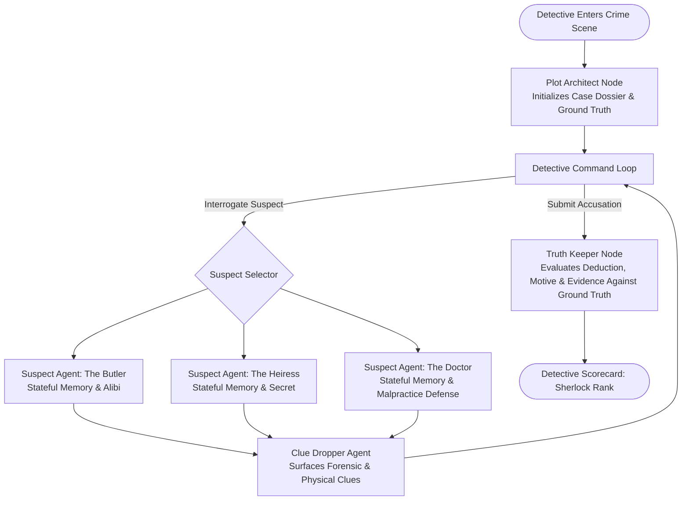

# Murder Mystery Engine & Autonomous Agent Arena

> Stateful multi-agent murder mystery game and conversational deduction engine powered by LangGraph, Google Gemini 2.0 Flash, and FastAPI.

[](https://www.python.org/downloads/)
[](https://github.com/langchain-ai/langgraph)
[](https://ai.google.dev/)
[](https://fastapi.tiangolo.com/)
[](tests/)

---

## What This Is

The **Murder Mystery Engine** is an interactive, stateful multi-agent game where you step into the shoes of a detective investigating a high-stakes crime. Every suspect is an autonomous, stateful agent with their own personality, secrets, alibis, and memory checkpointers. 

As you interrogate suspects, probe contradictions, and inspect the crime scene, dynamic forensic clues unlock in real time. When you have assembled your case, you bring your indictment before the **Truth Keeper** agent, who scores your deduction against the ground truth state graph.

---

## How to Run It (Zero-Friction Setup)

You can launch and play the game either via the interactive **Terminal CLI** or the **Web Dashboard Arena**. No mandatory API key is required — the engine includes a deterministic offline simulation engine alongside live **Gemini 2.0 Flash** support.

```bash
# 1. Clone repository
git clone https://github.com/Riser01/Personal-Projects.git
cd Personal-Projects

# 2. Install dependencies
pip install -r requirements.txt

# 3. (Optional) Provide Gemini API key for live generative responses
export GEMINI_API_KEY="your-gemini-api-key"

# 4A. Launch Interactive Terminal Detective Console
python play.py

# 4B. Or Launch Visual Web Arena Dashboard
python app.py
# Open your browser at http://127.0.0.1:8000
```

To run the automated test suite:
```bash
pytest tests/ -v
```

---

## Demo (Terminal CLI Simulation)

Run the full end-to-end detective simulation:
```bash
python play.py --demo
```

```
===========================================================================
DETECTIVE SIMULATION: Murder Mystery Engine (The Poisoned Chalice at Blackwood Manor)
===========================================================================

[PHASE 1: CRIME SCENE BRIEFING]
Victim:       Lord Reginald Blackwood (Age 68, Eccentric Industrialist)
Scene:        Private Study & Library, Blackwood Manor
Suspects:     Arthur Pendelton, Beatrice Blackwood, Dr. Alistair Finch

[PHASE 2: INTERROGATING SUSPECT 1 — ARTHUR PENDELTON (BUTLER)]
Detective: Where were you when Lord Reginald was poisoned?
Arthur: "As I stated to the constable, Detective, I was in the lower silver pantry from ten o'clock until eleven. One does not neglect the family crests, even on stormy nights."

[PHASE 3: INTERROGATING SUSPECT 2 — BEATRICE BLACKWOOD (HEIRESS)]
Detective: Did Lord Reginald mention amending his will?
Beatrice: "*stiffens noticeably* My personal finances are entirely my own concern, sir. Whatever debts I may carry, I would never harm a hair on his lordship's head."

[PHASE 4: INTERROGATING SUSPECT 3 — DR. ALISTAIR FINCH (PHYSICIAN)]
Detective: Did you examine the port decanter or prescribe Wolfsbane recently?
Dr. Finch: "*adjusts collar nervously* Aconite? Well... as a practitioner of homeopathic tinctures, I occasionally keep therapeutic micro-doses. But to suggest I administered a lethal draft to Reginald is preposterous!"
  >>> FORENSIC CLUE REVEALED: [Torn Apothecary Requisition Sheet] - A slip from Finch's personal clinic in Leeds ordering 50ml of liquid Aconite extract, dated just 4 days ago.
  >>> FORENSIC CLUE REVEALED: [Size 9 Oxford Shoe Prints by the Conservatory] - Traces of conservatory mud matching orthopedic soles used exclusively by Dr. Finch leading toward the study rear terrace.

Detective: Lord Reginald found your medical malpractice records regarding Lady Blackwood!
Dr. Finch: "Malpractice?! Reginald was confused in his final days—grief over poor Lady Blackwood clouded his judgment! Anything he scribbled in his blotter was the delusion of an ailing mind!"

[PHASE 5: COURT OF FORMAL ACCUSATION]
Indictment Target: Dr. Alistair Finch
Accusation Status: SOLVED
Total Score:       100 / 100
Detective Rank:    Master Detective (Sherlock Holmes Tier)
Summary:           Outstanding deduction! You successfully identified doctor_finch with flawless forensic alignment.

===========================================================================
SIMULATION RUN COMPLETED WITH ZERO ERRORS
===========================================================================
```

---

## How It Works

- **Plot Architect Node**: Generates a procedurally structured murder dossier containing the victim, crime scene, weapon, timeline, suspect alibis, hidden secrets, and ground truth culprit.
- **Stateful Suspect Nodes**: Each suspect maintains an independent conversation history and memory checkpointer. Innocent suspects defend their alibis and guard personal secrets (such as debts or forged letters); the guilty suspect subtly deflects and defends until confronted with forensic contradictions.
- **Clue Dropper Node**: Monitors the interrogation stream and performs keyword and intent recognition. When the detective asks breakthrough questions or probes contradictions, physical and forensic clues unlock in the Evidence Locker.
- **Truth Keeper Node**: Validates the detective's formal accusation against the ground truth state graph. Scores culprit identity (30 pts), murder weapon accuracy (10 pts), motive theory (40 pts), and cited evidence links (30 pts) to award final detective ranks.

---

## Multi-Agent Architecture



---

## Companion Multi-Agent Projects

In addition to the flagship Murder Mystery Engine, this repository includes architectural specifications and topologies for two runner-up agent systems:

| Project | Topology | Core Innovation | Documentation |
|---|---|---|---|
| 🥈 **RoastBot Arena** | Roaster Alpha ⇌ Roaster Beta → Fact Checker → Crowd Scorer | Real-time comedy battle with hallucination grounding and simulated audience scoring | [`docs/ROASTBOT_ARENA.md`](docs/ROASTBOT_ARENA.md) |
| 🥉 **InterviewForge** | Candidate → Ingestion → Adaptive Persona Pushback → Rubric Evaluator | Context-grounded technical system design simulator with anti-sycophantic pushback | [`docs/INTERVIEWFORGE.md`](docs/INTERVIEWFORGE.md) |

---

## Technology Stack

| Layer | Tool | Rationale |
|---|---|---|
| **Agent Orchestration** | LangGraph | Stateful cyclic graphs, checkpointing, and isolated multi-agent nodes |
| **LLM Engine** | Google Gemini 2.0 Flash | Sub-second latency, high reasoning quality, and free tier accessibility |
| **API Backend** | FastAPI + Uvicorn | Asynchronous execution, REST endpoints, and static file serving |
| **Frontend UI** | Vanilla JS + Tailwind CSS | Single-process dashboard with zero Node.js / npm build requirements |
| **Validation & Testing** | Pytest + Pydantic v2 | Strict schema enforcement, contract tests, and automated CI verification |

---

## Test Suite & Quality Gates

All 13 automated test specifications pass with zero failures:

| Test Domain | Target Invariant | Result |
|---|---|---|
| **LangGraph Interrogation Workflow** | State graph initializes, transitions, and mutates turn counters | **PASS** |
| **LangGraph Accusation Workflow** | Truth Keeper receives state, validates ground truth, and outputs scorecard | **PASS** |
| **Suspect Memory Isolation** | Suspect conversation histories remain strictly partitioned | **PASS** |
| **Suspect Multi-Turn Retention** | Suspect remembers earlier interrogation turns within the session | **PASS** |
| **Clue Triggering Logic** | Relevant keywords trigger clue reveals without false positives | **PASS** |
| **Duplicate Clue Prevention** | Unlocked clues cannot be unlocked multiple times | **PASS** |
| **Truth Keeper Deduction Scoring** | Accurate indictment receives Master Detective rank | **PASS** |
| **Innocent Accusation Failure** | Accusing an innocent suspect fails the case and awards Cold Case rank | **PASS** |
| **FastAPI Cases Endpoint** | Exposes curated mystery scenarios | **PASS** |
| **FastAPI Session Endpoint** | Initializes fresh session state | **PASS** |
| **FastAPI Interrogate Endpoint** | Routes question payload and returns suspect dialogue | **PASS** |
| **FastAPI Accuse Endpoint** | Formats accusation and returns scorecard | **PASS** |
| **End-to-End Simulation** | Full 5-phase game run executes from briefing to verdict | **PASS** |

---

## Project Structure

```
Personal-Projects/
├── README.md                  # Executive overview, architecture, quickstart
├── requirements.txt           # Pinned dependencies
├── pytest.ini                 # Pytest configuration
├── play.py                    # One-command CLI detective launcher
├── app.py                     # One-command Web arena launcher
├── .env.example               # Environment variable template
├── .gitignore                 # Ignore cache, logs, env files
├── src/
│   ├── __init__.py
│   ├── models.py              # Pydantic schemas (Suspect, Clue, Accusation, Scorecard)
│   ├── scenarios.py           # Curated murder mystery case dossiers
│   ├── llm.py                 # Gemini 2.0 Flash client + offline fallback engine
│   ├── graph.py               # LangGraph state machine & node functions
│   ├── engine.py              # Session management & LangGraph runner
│   ├── server.py              # FastAPI server & REST API
│   ├── cli.py                 # Interactive terminal UI & simulation runner
│   └── static/
│       ├── index.html         # Responsive dark-mode detective dashboard
│       └── app.js             # Client controller & interrogation event handler
├── docs/
│   ├── ROASTBOT_ARENA.md      # Comedy roast battle multi-agent spec
│   └── INTERVIEWFORGE.md      # System design interview simulator spec
├── output/
│   └── demo_cli.txt           # Verifiable terminal playthrough output
├── tests/
│   ├── test_graph.py          # LangGraph state transition tests
│   ├── test_suspects.py       # Suspect memory & isolation tests
│   ├── test_clue_dropper.py   # Clue reveal trigger tests
│   ├── test_truth_keeper.py   # Accusation scoring tests
│   ├── test_api.py            # FastAPI endpoint tests
│   └── test_simulation.py     # End-to-end playthrough test
└── learning/                  # Archived 2018-2019 ML coursework & case studies
    └── README.md              # Historical archive documentation
```

---

## Author

**Prajwal Rao** — [GitHub](https://github.com/Riser01)
