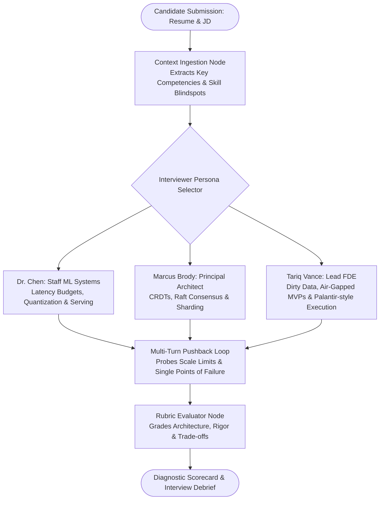

# InterviewForge — Context-Grounded AI Mock Technical Interview Simulator

> Multi-agent technical interview and system design simulator featuring realistic FAANG/Principal interviewer personas, anti-sycophantic pushback, and calibrated rubric grading.

## Concept Overview

Traditional AI mock interviewers suffer from sycophancy: they praise shallow, vague answers and fail to challenge edge cases. InterviewForge reverses this by embedding adversarial interviewer personas calibrated to actual Job Descriptions, pushing candidates on throughput, failover, concurrency, and distributed state.

## Multi-Agent Graph Topology

## Core Differentiators

1. **Anti-Sycophantic Prompt Engineering**: Explicitly prohibits empty flattery. If an architecture fails at 100k QPS, the agent demands a failure mitigation strategy.
2. **Context-Grounded Rubric**: Calibrates evaluation directly against the candidate's target company (e.g. Meta E6 vs. Early-Stage Staff).
3. **State Machine Transitions**: Tracks question difficulty adaptation (escalating to harder trade-offs when candidate performs well; offering targeted hints when stuck).
