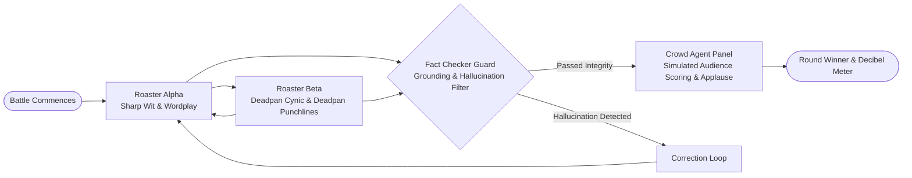

# RoastBot Arena — AI Comedy Roast Battle

> Autonomous multi-agent comedy roast battle orchestrating locked persona agents, real-time adversarial rounds, hallucination guards, and simulated audience scoring.

## Concept Overview

RoastBot Arena stages dynamic comedy roast battles between two contrasting comedic agents (e.g. Sharp Wit vs. Deadpan Cynic) or roasts user-submitted GitHub / LinkedIn profiles with dynamic crowd voting.

## Multi-Agent Graph Topology

## Agent Personas & Node Responsibilities

1. **Roaster Alpha ("The Acid Wit")**: Rapid-fire associative humor, hyperbole, and sharp cultural analogies.
2. **Roaster Beta ("The Deadpan Cynic")**: Monotone delivery, devastating understatement, and analytical breakdown of opponent arguments.
3. **Fact Checker Node**: Prevents roasters from fabricating non-existent public profile details, maintaining comedic grounding against grounded truth.
4. **Crowd Agent Panel (Scorer Node)**: Simulates 5 diverse comedy club archetypes (The Heckler, The Comedy Purist, The Easy Laugh, The Skeptic, The Industry Scout), compiling round-by-round point tallies.

## Implementation Architecture

- **Orchestration**: LangGraph cyclic state machine with alternating dialogue edges.
- **State Checkpointing**: Memory checkpoints maintain callback jokes, escalating insults, and audience applause meters across 3 rounds.
- **Latency Budget**: Sub-800ms generation per turn using Google Gemini 2.0 Flash.
